# Debt Detective

This project analyzes dependencies and provides information on potential vulnerabilities and solutions.

## Features

- Comprehensive analysis of project dependencies
- Identification of vulnerabilities and guidance on solutions
- Consideration of GitHub update frequency, forks, and stars to avoid untested code
- Alert for deprecated dependencies and guidance on latest versions
- Streamlined virtual environment and software version management with one-click installation

## Parameters

To help quantify technical debt, we have identified five key parameters.

1. Package Vulnerability and Security
2. Community Activeness and Maintenance
3. Coding Quality and Standard
4. Code Vulnerability and security
5. Depreciated ,Dead and Outdated code

## Score Calculation

    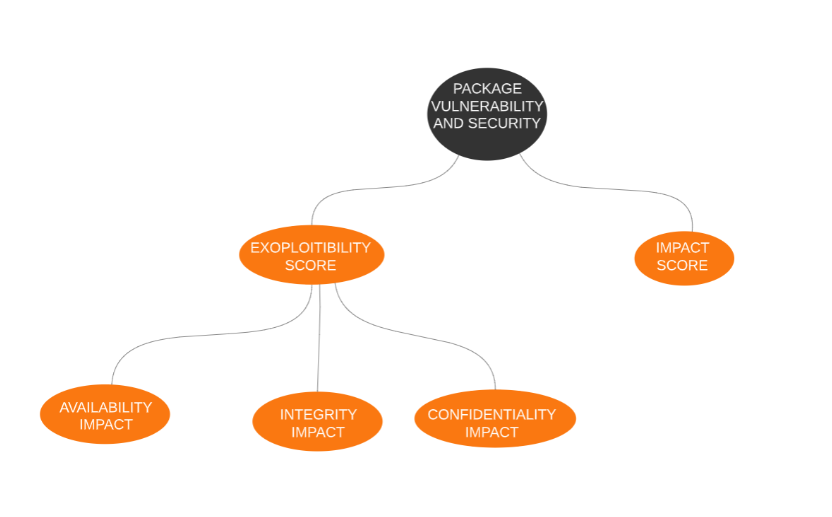
    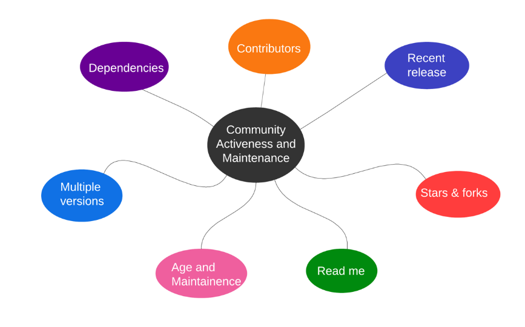

## Installation

Clone the repo https://github.com/Ganesh-P03/SE_tool_team5
This consists of two folders debt-detective(frontend),backend

**Frontend:**

1. `npm i`
2. Yarn is also required. If yarn is not in your system, install it with `npm install yarn`
3. Run `yarn run build`
4. Open only this folder in VSCode.
5. Locate `extension.ts` (`ext-src/extension.ts`). On the top menu bar of VSCode, click the run button.
6. If any prompt occurs, choose VSCode extension development.
7. Now to test the extension, open the backend folder from the extension host window.
8. Locate `main.py` file.
9. Click on the extension icon in the side panel to see the WebView!!

**Backend:**

1. Creating virtual environment with `pip install env`
2. `python -m venv venv`
3. `venv/Scripts/Activate`
4. Install required dependencies with `pip install -r requirements.txt`
5. Start the server with `uvicorn main:app --reload`

## Screenshots

<h1>Phase-1</h1>
<h3>Code entropy graph</h3>
    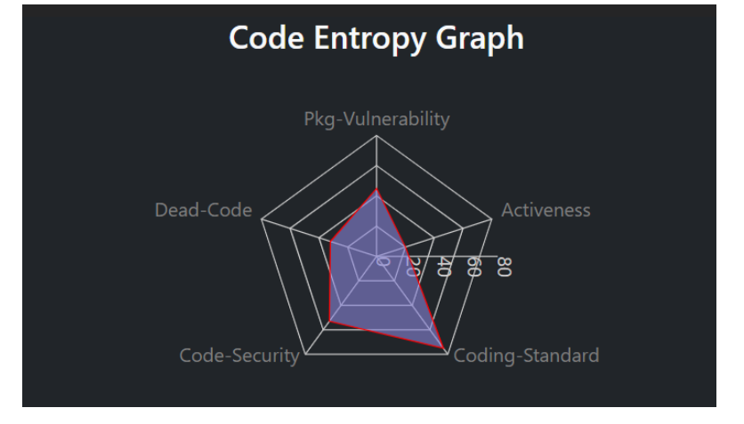
<h3>5 Major parameters</h3>
    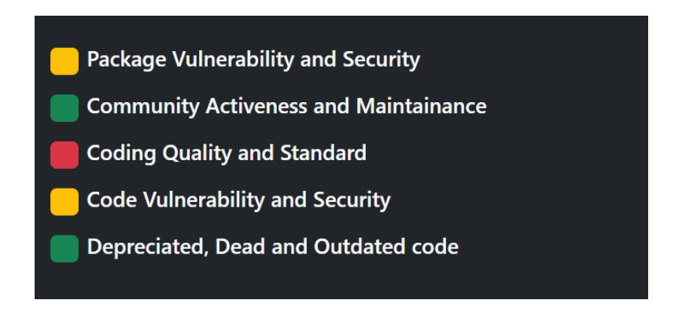
<h3>CVE details</h3>
    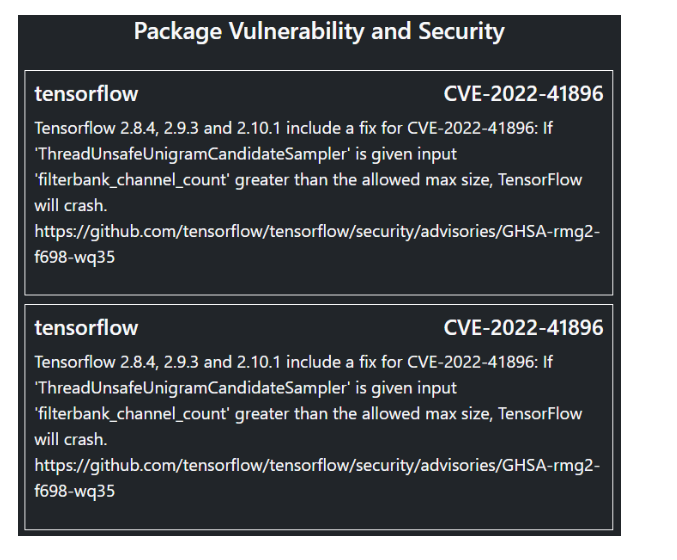
 <h3>Community Activeness graph</h3>
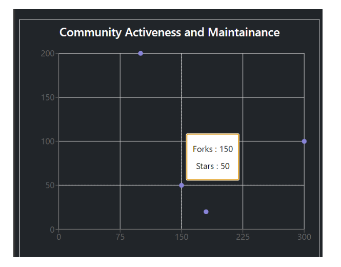
<h1>Phase-2</h1>
<h3>Highlighting feature</h3>
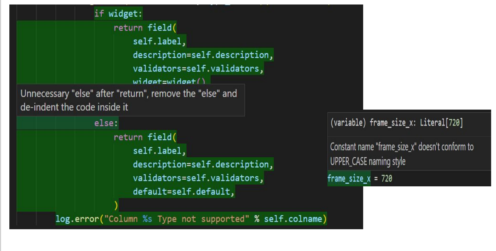
<h3>Score Calculation metric for Community,Package Vulnerability and Code Vulnerability </h3>
    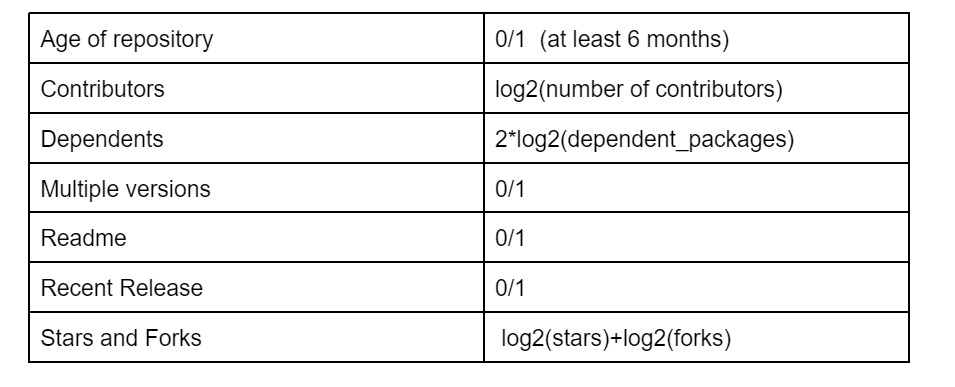
     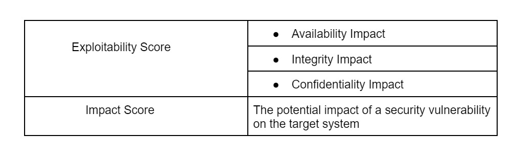
    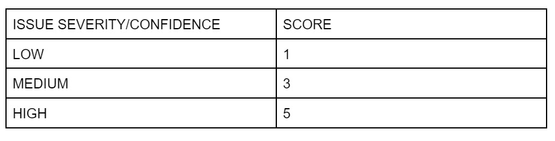
<h3>Subparameter elaboration</h3>
 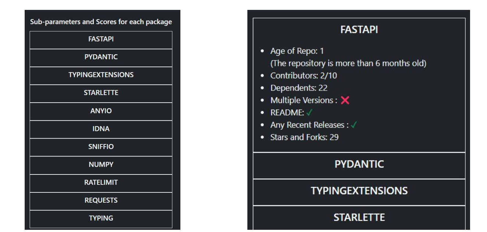

